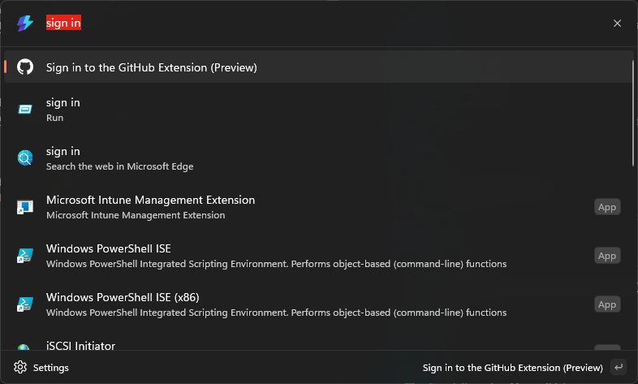

# Welcome to the Command Palette (CmdPal) GitHub Extension (Preview) repo

This repository contains the source code for:

* [Command Palette GitHub Extension](https://github.com/microsoft/CmdPalGitHubExtension)

Related repositories include:

* [PowerToys Command Palette utility](https://github.com/microsoft/PowerToys/tree/main/src/modules/cmdpal)

## Installing and running Command Palette GitHub Extension (Preview)

### Requirements
The Command Palette GitHub Extension requires:
* PowerToys with Command Palette included
* Windows 11
* An ARM64 or x64 processor

### Command Palette [Recommended]

* In Command Palette, search for "Install Command Palette extensions" and press Enter.
* Search for "Command Palette GitHub Extension (Preview)".
* Press enter to download the extension.
* Navigate back to the main screen. If the extension was able to detect your account automatically, you will see the following commands:
    * Saved queries
    * Assigned to me
    * Created issues
    * My pull requests
    * Mentions me
* Otherwise, you'll see a "Sign in" command. Click sign in to login via the GitHub OAuth flows.

### WinGet

More instructions coming soon!

### Microsoft Store

The Command Palette GitHub Extension is coming to the Microsoft Store. Stay tuned for updates and instructions.

### Other install methods

#### Via GitHub

For users who are unable to install the Command Palette GitHub Extension from the winget or the Microsoft Store, released builds can be manually downloaded from this repository's [Releases page](https://github.com/microsoft/CmdPalGitHubExtension/releases).

## Using the extension

In order to use the extension, open Command Palette by pressing `Win+Alt+Space` or opening it from the Windows Start Menu. Learn more about using Command Palette by reading [this guide](https://learn.microsoft.com/en-us/windows/powertoys/command-palette/overview).

### Sign in to your GitHub account

Sign in to the GitHub extension by typing "Sign in" in the Command Palette's search bar and selecting this command:

Press enter or click the "Sign In" button to sign in on github.com:

### Get started with the default queries

After signing in, you will see the following commands:

You can type any of them on the Command Palette's search bar. Press enter or click it to run the command and see a list of items related to the selected query:

If these queries aren't quite what you need, take a look at adding or editing a query below.

### Add a query

You can also add custom queries to the extension. The fastest way is to find or create the query on github.com:

Once you set what you'd like, you can either:
* Copy the URL from the browser (not shown in the screenshot) or 
* Copy the text in the search bar. This "search string" uses the [GitHub search syntax](https://docs.github.com/en/search-github/searching-on-github/searching-issues-and-pull-requests)

On Command Palette, select "Saved GitHub queries" and then "Add a query". The following form will be shown:

On the "Query name" field, put anything you would like. This will be the display name of your query in Command Palette, and can be used by you to quickly find it.
On the second input, we will paste the "query string" or URL and select "Save query":

The check box can be marked if you want the query to appear in the top level (or main) page of Command Palette. Otherwise, the query will be only listed inside the "Saved GitHub queries" page.

Finally, click save. The query is now saved in the extension and you can reference it in Command Palette anytime you want!

### Using a query

### Edit a query

If you ever want to change an exisitng query, find the query and, once highlighted, enter `Ctrl`+`K` (Command Palette's keyboard shortcut for opening additional commands) and then select "Edit query":

This will open a similar form to "Add a query". Update the fields you want and select "Save edited query" to update the query:

### Other actions to explore:
* If you no longer want a query saved on the extension, navigate to it, press `Ctrl`+`K`, then select "Remove saved query". You can also use the shortcuts that are shown in the Command Palette.
* 

### Settings and Shortcuts

---

## Contributing

We are excited to work alongside you, our amazing community, to build and enhance the Command Palette GitHub Extension!

## Communicating with the team

The easiest way to communicate with the team is via GitHub issues.

Please file new issues, feature requests and suggestions, but **DO search for similar open/closed preexisting issues before creating a new issue.**

Add this to your Saved Queries: *repo:microsoft/CmdPalGitHubExtension is:issue*

If you would like to ask a question that you feel doesn't warrant an issue (yet), please reach out to us via X or Bluesky:

* Kayla Cinnamon, Senior Product Manager: [@cinnamon_msft on X](https://twitter.com/cinnamon_msft), [@kaylacinnamon on Bluesky](https://bsky.app/profile/kaylacinnamon.bsky.social)
* Clint Rutkas, Principal Product Manager: [@clintrutkas on X](https://twitter.com/clintrutkas), [@clintrutkas on Bluesky](https://bsky.app/profile/clintrutkas.bsky.social)

## Building the code

* Clone the repository
* Uninstall the Command Palette GitHub Extension (Command Palette has a hard time choosing which extension to use if two versions exist)
* Open `GitHubExtension.sln` in Visual Studio 2022 or later and build from the IDE, or run `build\scripts\Build.ps1` from a Visual Studio command prompt.

### OAuth App
Since secrets cannot be checked in to the repository, developers must create their own test OAuth app for local tests.

Follow this link https://docs.github.com/en/developers/apps/building-oauth-apps/creating-an-oauth-app to create a Git OAuth app (with RedirectUri = "cmdpalghext://oauth_redirect_uri/").

The OAuth App ClientId and ClientSecret can be added as environment variables using the following instructions:

    On an elevated cmd window:
        setx GITHUB_CLIENT_ID "Your OAuth App's ClientId" /m
        setx GITHUB_CLIENT_SECRET "Your OAuth App's ClientSecret" /m

---

## Code of Conduct

We welcome contributions and suggestions. Most contributions require you to agree to a Contributor License Agreement (CLA) declaring that you have the right to, and actually do, grant us the rights to use your contribution. For details, visit https://cla.opensource.microsoft.com.

When you submit a pull request, a CLA bot will automatically determine whether you need to provide a CLA and decorate the PR appropriately (e.g., status check, comment). Simply follow the instructions provided by the bot. You will only need to do this once across all repos using our CLA.

This project has adopted the [Microsoft Open Source Code of Conduct](https://opensource.microsoft.com/codeofconduct/). For more information see the [Code of Conduct FAQ](https://opensource.microsoft.com/codeofconduct/faq/) or contact [opencode@microsoft.com](mailto:opencode@microsoft.com) with any additional questions or comments.

## Trademarks

This project may contain trademarks or logos for projects, products, or services. Authorized use of Microsoft trademarks or logos is subject to and must follow [Microsoft's Trademark & Brand Guidelines](https://www.microsoft.com/en-us/legal/intellectualproperty/trademarks/usage/general). Use of Microsoft trademarks or logos in modified versions of this project must not cause confusion or imply Microsoft sponsorship. Any use of third-party trademarks or logos are subject to those third-party's policies.
