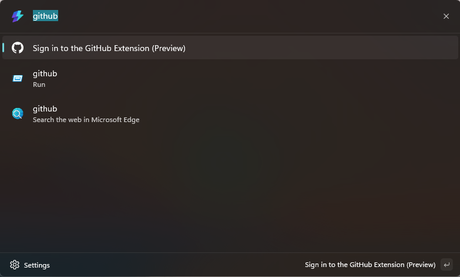

# Command Palette GitHub Extension (Preview) Quick Start Guide

Welcome to the Command Palette GitHub Extension (Preview) Quick Start Guide! Below are the instructions to get started.

## Signing in

Open Command Palette by pressing `Win`+`Alt`+`Space` or your custom keyboard shortcut. Then, search for "github" in the search box. Select the "Sign in to the GitHub Extension (Preview)" command:



Then press enter or select the "Sign in" button to sign in on github.com:


Once you've signed in, you can go back to the top level (or home screen) by selecting the back arrow or navigating to the search bar and pressing `Esc`.

Now, at the top level, search "github" again. You should see the following commands:


> Don't worry if these are not in the same order as the screenshot. You can easily find what you need by typing out the first few letters of the command you want.

## Viewing a query

Let's see what these queries can do. Select any query you'd like. 

Each query opens a page with the relevant results from GitHub:


You can use the search bar at the top to search for what you need. With each item, you can open the context menu (press `Ctrl`+`K` or click on the three little dots in the bottom right corner) to see the actions you can perform. Some examples include:
* Opening the item link in your browser
* Copying the item title and URL
* View item in Command Palette - displays the message Markdown in Command Palette.

## Adding queries

Now that you've seen what you can do with queries, add your own! Follow these steps:

* From the top level, navigate to the "Saved GitHub queries" command, then select "Add a query"


* Fill out the form in the Add page:

    

    Here's an overview of what you'll need:
    * **Query name:** The name for the search in Command Palette. Defaults to the saved query's string.
    *  **Query string or URL:** Either the search terms using the [GitHub search syntax](https://docs.github.com/en/search-github/searching-on-github/searching-issues-and-pull-requests) (e.g. ```repo:microsoft/PowerToys is:issue label:"Product-CommandPalette"```) or the URL for the query on github.com. Notice that the search string doesn't include the item type or repository. In this case, use the URL for best results.
    
    * **Pin query to top-level commands:** Select this checkbox if you want to access the item from the top level (the same place you found the "Sign in to the GitHub extension (Preview)" command). Every query can be found under the "Saved GitHub queries" command.
* Press Save query
* You can now find your saved search by navigating back (either by navigating to the search bar and pressing `Esc` or clicking on the back arrow):
    

## Editing queries

If you'd like to update a query (e.g. move it to the top level), find the query at the top level or in "Saved GitHub queries", press `Ctrl`+`K` or click on the three little dots in the bottom right corner and select "Edit query". This will open to an edit page similar to the "Save query" page above. Update what you'd like and press "Save edited query".
> There's a known bug that success and error notifications will not appear on the edit page if the page was opened from a top level command [(you can track its status here)](https://github.com/microsoft/PowerToys/issues/39936). Edit from the Saved GitHub queries page for best results.

## Troubleshooting

If you're not seeing the extension when searching for "GitHub" or facing another issue, you can reload your Command Palette extensions by typing in "reload" and selecting the "Reload Command Palette extensions" command:


If these steps don't help, please [file an issue](https://github.com/microsoft/CmdPalGitHubExtension/issues/new).

You can find the extension logs in ```%localappdata%\Packages\Microsoft.CmdPalGitHubExtension_8wekyb3d8bbwe\TempState```.